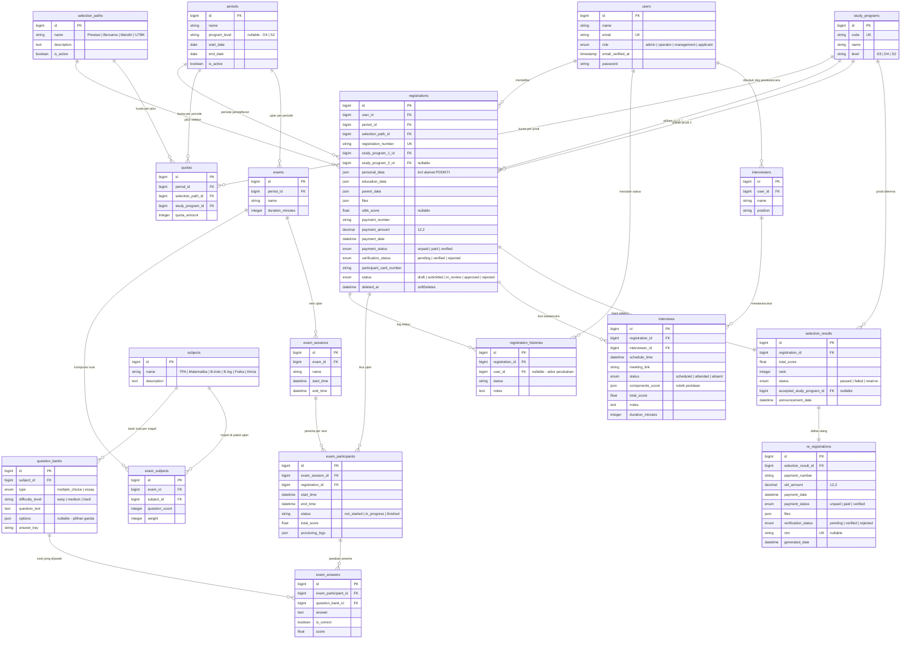

# ERD — Sistem Informasi PMB Politeknik STTT Bandung

> 17 tabel · 22 relasi · Preview dengan Mermaid.js

```mermaid
erDiagram
    users {
        bigint id PK
        string name
        string email UK
        enum role "admin | operator | management | applicant"
        timestamp email_verified_at
        string password
    }

    study_programs {
        bigint id PK
        string code UK
        string name
        string level "D3 | D4 | S2"
    }

    periods {
        bigint id PK
        string name
        string program_level "nullable - D4 | S2"
        date start_date
        date end_date
        boolean is_active
    }

    selection_paths {
        bigint id PK
        string name "Prestasi | Bersama | Mandiri | UTBK"
        text description
        boolean is_active
    }

    quotas {
        bigint id PK
        bigint period_id FK
        bigint selection_path_id FK
        bigint study_program_id FK
        integer quota_amount
    }

    registrations {
        bigint id PK
        bigint user_id FK
        bigint period_id FK
        bigint selection_path_id FK
        string registration_number UK
        bigint study_program_1_id FK
        bigint study_program_2_id FK "nullable"
        json personal_data "incl alamat PDDIKTI"
        json education_data
        json parent_data
        json files
        float utbk_score "nullable"
        string payment_number
        decimal payment_amount "12,2"
        datetime payment_date
        enum payment_status "unpaid | paid | verified"
        enum verification_status "pending | verified | rejected"
        string participant_card_number
        enum status "draft | submitted | in_review | approved | rejected"
        datetime deleted_at "softDeletes"
    }

    registration_histories {
        bigint id PK
        bigint registration_id FK
        bigint user_id FK "nullable - aktor perubahan"
        string status
        text notes
    }

    subjects {
        bigint id PK
        string name "TPA | Matematika | B.Indo | B.Ing | Fisika | Kimia"
        text description
    }

    question_banks {
        bigint id PK
        bigint subject_id FK
        enum type "multiple_choice | essay"
        string difficulty_level "easy | medium | hard"
        text question_text
        json options "nullable - pilihan ganda"
        string answer_key
    }

    exams {
        bigint id PK
        bigint period_id FK
        string name
        integer duration_minutes
    }

    exam_subjects {
        bigint id PK
        bigint exam_id FK
        bigint subject_id FK
        integer question_count
        integer weight
    }

    exam_sessions {
        bigint id PK
        bigint exam_id FK
        string name
        datetime start_time
        datetime end_time
    }

    exam_participants {
        bigint id PK
        bigint exam_session_id FK
        bigint registration_id FK
        datetime start_time
        datetime end_time
        string status "not_started | in_progress | finished"
        float total_score
        json proctoring_logs
    }

    exam_answers {
        bigint id PK
        bigint exam_participant_id FK
        bigint question_bank_id FK
        text answer
        boolean is_correct
        float score
    }

    interviewers {
        bigint id PK
        bigint user_id FK
        string name
        string position
    }

    interviews {
        bigint id PK
        bigint registration_id FK
        bigint interviewer_id FK
        datetime schedule_time
        string meeting_link
        enum status "scheduled | attended | absent"
        json components_score "rubrik penilaian"
        float total_score
        text notes
        integer duration_minutes
    }

    selection_results {
        bigint id PK
        bigint registration_id FK
        float total_score
        integer rank
        enum status "passed | failed | reserve"
        bigint accepted_study_program_id FK "nullable"
        datetime announcement_date
    }

    re_registrations {
        bigint id PK
        bigint selection_result_id FK
        string payment_number
        decimal ukt_amount "12,2"
        datetime payment_date
        enum payment_status "unpaid | paid | verified"
        json files
        enum verification_status "pending | verified | rejected"
        string nim UK "nullable"
        datetime generated_date
    }

    %% ===== RELATIONSHIPS =====

    users ||--o{ registrations : "mendaftar"
    users ||--o{ registration_histories : "merubah status"
    users ||--o{ interviewers : "ditunjuk sbg pewawancara"

    periods ||--o{ registrations : "periode pendaftaran"
    periods ||--o{ quotas : "kuota per periode"
    periods ||--o{ exams : "ujian per periode"

    selection_paths ||--o{ registrations : "jalur seleksi"
    selection_paths ||--o{ quotas : "kuota per jalur"

    study_programs ||--o{ quotas : "kuota per prodi"
    study_programs ||--o{ registrations : "pilihan prodi 1"
    study_programs ||--o{ registrations : "pilihan prodi 2"
    study_programs ||--o{ selection_results : "prodi diterima"

    registrations ||--o{ registration_histories : "log status"
    registrations ||--o{ exam_participants : "ikut ujian"
    registrations ||--o{ interviews : "ikut wawancara"
    registrations ||--|| selection_results : "hasil seleksi"

    subjects ||--o{ question_banks : "bank soal per mapel"
    subjects ||--o{ exam_subjects : "mapel di paket ujian"

    exams ||--o{ exam_subjects : "komposisi soal"
    exams ||--o{ exam_sessions : "sesi ujian"

    exam_sessions ||--o{ exam_participants : "peserta per sesi"

    exam_participants ||--o{ exam_answers : "jawaban peserta"

    question_banks ||--o{ exam_answers : "soal yang dijawab"

    interviewers ||--o{ interviews : "mewawancarai"

    selection_results ||--|| re_registrations : "daftar ulang"
```
