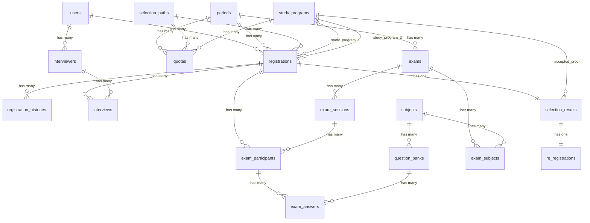

# Migrations — Sistem Informasi PMB Politeknik STTT Bandung

Dokumen ini berisi seluruh file migration Laravel untuk sistem PMB.
Semua nama tabel menggunakan **bahasa Inggris**, mengikuti konvensi Laravel (*plural*, *snake_case*).

> **Catatan:**
> - Urutan file migration sudah disusun berdasarkan dependensi foreign key.
> - Feedback user yang sudah diakomodasi:
>   - Tabel `registration_histories` untuk log historis status (terpisah).
>   - Kolom `program_level` pada tabel `periods` untuk membedakan periode D4, S2, dll.
>   - Data alamat di `personal_data` (JSON) mencakup negara, provinsi, kota/kab, kecamatan, kelurahan mengikuti kode PDDIKTI.
>   - Semua role user digabung dalam satu tabel `users` dengan kolom `role`.

---

## Migration 1 — Add Role to Users Table

**File:** `2026_07_17_100001_add_role_to_users_table.php`

```php
<?php

use Illuminate\Database\Migrations\Migration;
use Illuminate\Database\Schema\Blueprint;
use Illuminate\Support\Facades\Schema;

return new class extends Migration
{
    public function up(): void
    {
        Schema::table('users', function (Blueprint $table) {
            $table->enum('role', ['admin', 'operator', 'management', 'applicant'])->default('applicant')->after('email');
        });
    }

    public function down(): void
    {
        Schema::table('users', function (Blueprint $table) {
            $table->dropColumn('role');
        });
    }
};
```

---

## Migration 2 — Create Study Programs Table

**File:** `2026_07_17_100002_create_study_programs_table.php`

```php
<?php

use Illuminate\Database\Migrations\Migration;
use Illuminate\Database\Schema\Blueprint;
use Illuminate\Support\Facades\Schema;

return new class extends Migration
{
    public function up(): void
    {
        Schema::create('study_programs', function (Blueprint $table) {
            $table->id();
            $table->string('code')->unique();
            $table->string('name');
            $table->string('level'); // D3, D4, S2
            $table->timestamps();
        });
    }

    public function down(): void
    {
        Schema::dropIfExists('study_programs');
    }
};
```

---

## Migration 3 — Create Periods Table

**File:** `2026_07_17_100003_create_periods_table.php`

> Kolom `program_level` ditambahkan agar periode pendaftaran dapat dibedakan antar jenjang (D4, S2, dll.) karena jadwal bisa berbeda.

```php
<?php

use Illuminate\Database\Migrations\Migration;
use Illuminate\Database\Schema\Blueprint;
use Illuminate\Support\Facades\Schema;

return new class extends Migration
{
    public function up(): void
    {
        Schema::create('periods', function (Blueprint $table) {
            $table->id();
            $table->string('name');
            $table->string('program_level')->nullable(); // D4, S2, dll.
            $table->date('start_date');
            $table->date('end_date');
            $table->boolean('is_active')->default(true);
            $table->timestamps();
        });
    }

    public function down(): void
    {
        Schema::dropIfExists('periods');
    }
};
```

---

## Migration 4 — Create Selection Paths Table

**File:** `2026_07_17_100004_create_selection_paths_table.php`

```php
<?php

use Illuminate\Database\Migrations\Migration;
use Illuminate\Database\Schema\Blueprint;
use Illuminate\Support\Facades\Schema;

return new class extends Migration
{
    public function up(): void
    {
        Schema::create('selection_paths', function (Blueprint $table) {
            $table->id();
            $table->string('name'); // Prestasi, Bersama, Mandiri, UTBK
            $table->text('description')->nullable();
            $table->boolean('is_active')->default(true);
            $table->timestamps();
        });
    }

    public function down(): void
    {
        Schema::dropIfExists('selection_paths');
    }
};
```

---

## Migration 5 — Create Quotas Table

**File:** `2026_07_17_100005_create_quotas_table.php`

```php
<?php

use Illuminate\Database\Migrations\Migration;
use Illuminate\Database\Schema\Blueprint;
use Illuminate\Support\Facades\Schema;

return new class extends Migration
{
    public function up(): void
    {
        Schema::create('quotas', function (Blueprint $table) {
            $table->id();
            $table->foreignId('period_id')->constrained()->cascadeOnDelete();
            $table->foreignId('selection_path_id')->constrained()->cascadeOnDelete();
            $table->foreignId('study_program_id')->constrained()->cascadeOnDelete();
            $table->integer('quota_amount');
            $table->timestamps();

            $table->unique(['period_id', 'selection_path_id', 'study_program_id'], 'quota_unique');
        });
    }

    public function down(): void
    {
        Schema::dropIfExists('quotas');
    }
};
```

---

## Migration 6 — Create Registrations Table

**File:** `2026_07_17_100006_create_registrations_table.php`

> Kolom `personal_data` (JSON) menyimpan data pribadi termasuk alamat lengkap dengan kode negara, provinsi, kota/kab, kecamatan, kelurahan sesuai referensi PDDIKTI — untuk memfasilitasi pendaftar dari luar negeri.

**Contoh struktur JSON `personal_data`:**
```json
{
  "full_name": "...",
  "nik": "...",
  "gender": "...",
  "birth_place": "...",
  "birth_date": "...",
  "phone": "...",
  "country_code": "ID",
  "province_code": "32",
  "city_code": "3273",
  "district_code": "327301",
  "sub_district_code": "3273011001",
  "address": "...",
  "postal_code": "..."
}
```

```php
<?php

use Illuminate\Database\Migrations\Migration;
use Illuminate\Database\Schema\Blueprint;
use Illuminate\Support\Facades\Schema;

return new class extends Migration
{
    public function up(): void
    {
        Schema::create('registrations', function (Blueprint $table) {
            $table->id();
            $table->foreignId('user_id')->constrained()->cascadeOnDelete();
            $table->foreignId('period_id')->constrained()->cascadeOnDelete();
            $table->foreignId('selection_path_id')->constrained()->cascadeOnDelete();

            $table->string('registration_number')->unique();
            $table->foreignId('study_program_1_id')->constrained('study_programs');
            $table->foreignId('study_program_2_id')->nullable()->constrained('study_programs');

            // JSON: data pribadi (incl. alamat kode PDDIKTI + negara), pendidikan, orang tua
            $table->json('personal_data')->nullable();
            $table->json('education_data')->nullable();
            $table->json('parent_data')->nullable();
            $table->json('files')->nullable();
            $table->float('utbk_score')->nullable();

            // Pembayaran
            $table->string('payment_number')->nullable();
            $table->decimal('payment_amount', 12, 2)->nullable();
            $table->dateTime('payment_date')->nullable();
            $table->enum('payment_status', ['unpaid', 'paid', 'verified'])->default('unpaid');

            // Verifikasi & Status
            $table->enum('verification_status', ['pending', 'verified', 'rejected'])->default('pending');
            $table->string('participant_card_number')->nullable();
            $table->enum('status', ['draft', 'submitted', 'in_review', 'approved', 'rejected'])->default('draft');

            $table->timestamps();
            $table->softDeletes();
        });
    }

    public function down(): void
    {
        Schema::dropIfExists('registrations');
    }
};
```

---

## Migration 7 — Create Registration Histories Table

**File:** `2026_07_17_100007_create_registration_histories_table.php`

> Tabel terpisah untuk mencatat log perubahan status pendaftaran (sesuai permintaan user).

```php
<?php

use Illuminate\Database\Migrations\Migration;
use Illuminate\Database\Schema\Blueprint;
use Illuminate\Support\Facades\Schema;

return new class extends Migration
{
    public function up(): void
    {
        Schema::create('registration_histories', function (Blueprint $table) {
            $table->id();
            $table->foreignId('registration_id')->constrained()->cascadeOnDelete();
            $table->foreignId('user_id')->nullable()->constrained()->nullOnDelete();
            $table->string('status');
            $table->text('notes')->nullable();
            $table->timestamps();
        });
    }

    public function down(): void
    {
        Schema::dropIfExists('registration_histories');
    }
};
```

---

## Migration 8 — Create Subjects Table

**File:** `2026_07_17_100008_create_subjects_table.php`

> Mata ujian: TPA, Matematika, Bahasa Indonesia, Bahasa Inggris, Fisika, Kimia.

```php
<?php

use Illuminate\Database\Migrations\Migration;
use Illuminate\Database\Schema\Blueprint;
use Illuminate\Support\Facades\Schema;

return new class extends Migration
{
    public function up(): void
    {
        Schema::create('subjects', function (Blueprint $table) {
            $table->id();
            $table->string('name');
            $table->text('description')->nullable();
            $table->timestamps();
        });
    }

    public function down(): void
    {
        Schema::dropIfExists('subjects');
    }
};
```

---

## Migration 9 — Create Question Banks Table

**File:** `2026_07_17_100009_create_question_banks_table.php`

```php
<?php

use Illuminate\Database\Migrations\Migration;
use Illuminate\Database\Schema\Blueprint;
use Illuminate\Support\Facades\Schema;

return new class extends Migration
{
    public function up(): void
    {
        Schema::create('question_banks', function (Blueprint $table) {
            $table->id();
            $table->foreignId('subject_id')->constrained()->cascadeOnDelete();
            $table->enum('type', ['multiple_choice', 'essay'])->default('multiple_choice');
            $table->string('difficulty_level')->default('medium'); // easy, medium, hard
            $table->text('question_text');
            $table->json('options')->nullable(); // Pilihan A, B, C, D, E
            $table->string('answer_key')->nullable();
            $table->timestamps();
        });
    }

    public function down(): void
    {
        Schema::dropIfExists('question_banks');
    }
};
```

---

## Migration 10 — Create Exams Table

**File:** `2026_07_17_100010_create_exams_table.php`

```php
<?php

use Illuminate\Database\Migrations\Migration;
use Illuminate\Database\Schema\Blueprint;
use Illuminate\Support\Facades\Schema;

return new class extends Migration
{
    public function up(): void
    {
        Schema::create('exams', function (Blueprint $table) {
            $table->id();
            $table->foreignId('period_id')->constrained()->cascadeOnDelete();
            $table->string('name');
            $table->integer('duration_minutes');
            $table->timestamps();
        });
    }

    public function down(): void
    {
        Schema::dropIfExists('exams');
    }
};
```

---

## Migration 11 — Create Exam Subjects Table

**File:** `2026_07_17_100011_create_exam_subjects_table.php`

```php
<?php

use Illuminate\Database\Migrations\Migration;
use Illuminate\Database\Schema\Blueprint;
use Illuminate\Support\Facades\Schema;

return new class extends Migration
{
    public function up(): void
    {
        Schema::create('exam_subjects', function (Blueprint $table) {
            $table->id();
            $table->foreignId('exam_id')->constrained()->cascadeOnDelete();
            $table->foreignId('subject_id')->constrained()->cascadeOnDelete();
            $table->integer('question_count');
            $table->integer('weight'); // Bobot nilai
            $table->timestamps();
        });
    }

    public function down(): void
    {
        Schema::dropIfExists('exam_subjects');
    }
};
```

---

## Migration 12 — Create Exam Sessions Table

**File:** `2026_07_17_100012_create_exam_sessions_table.php`

```php
<?php

use Illuminate\Database\Migrations\Migration;
use Illuminate\Database\Schema\Blueprint;
use Illuminate\Support\Facades\Schema;

return new class extends Migration
{
    public function up(): void
    {
        Schema::create('exam_sessions', function (Blueprint $table) {
            $table->id();
            $table->foreignId('exam_id')->constrained()->cascadeOnDelete();
            $table->string('name');
            $table->dateTime('start_time');
            $table->dateTime('end_time');
            $table->timestamps();
        });
    }

    public function down(): void
    {
        Schema::dropIfExists('exam_sessions');
    }
};
```

---

## Migration 13 — Create Exam Participants Table

**File:** `2026_07_17_100013_create_exam_participants_table.php`

```php
<?php

use Illuminate\Database\Migrations\Migration;
use Illuminate\Database\Schema\Blueprint;
use Illuminate\Support\Facades\Schema;

return new class extends Migration
{
    public function up(): void
    {
        Schema::create('exam_participants', function (Blueprint $table) {
            $table->id();
            $table->foreignId('exam_session_id')->constrained()->cascadeOnDelete();
            $table->foreignId('registration_id')->constrained()->cascadeOnDelete();
            $table->dateTime('start_time')->nullable();
            $table->dateTime('end_time')->nullable();
            $table->string('status')->default('not_started'); // not_started, in_progress, finished
            $table->float('total_score')->nullable();
            $table->json('proctoring_logs')->nullable();
            $table->timestamps();
        });
    }

    public function down(): void
    {
        Schema::dropIfExists('exam_participants');
    }
};
```

---

## Migration 14 — Create Exam Answers Table

**File:** `2026_07_17_100014_create_exam_answers_table.php`

```php
<?php

use Illuminate\Database\Migrations\Migration;
use Illuminate\Database\Schema\Blueprint;
use Illuminate\Support\Facades\Schema;

return new class extends Migration
{
    public function up(): void
    {
        Schema::create('exam_answers', function (Blueprint $table) {
            $table->id();
            $table->foreignId('exam_participant_id')->constrained()->cascadeOnDelete();
            $table->foreignId('question_bank_id')->constrained()->cascadeOnDelete();
            $table->text('answer')->nullable();
            $table->boolean('is_correct')->nullable();
            $table->float('score')->nullable();
            $table->timestamps();
        });
    }

    public function down(): void
    {
        Schema::dropIfExists('exam_answers');
    }
};
```

---

## Migration 15 — Create Interviewers Table

**File:** `2026_07_17_100015_create_interviewers_table.php`

```php
<?php

use Illuminate\Database\Migrations\Migration;
use Illuminate\Database\Schema\Blueprint;
use Illuminate\Support\Facades\Schema;

return new class extends Migration
{
    public function up(): void
    {
        Schema::create('interviewers', function (Blueprint $table) {
            $table->id();
            $table->foreignId('user_id')->constrained()->cascadeOnDelete();
            $table->string('name');
            $table->string('position')->nullable();
            $table->timestamps();
        });
    }

    public function down(): void
    {
        Schema::dropIfExists('interviewers');
    }
};
```

---

## Migration 16 — Create Interviews Table

**File:** `2026_07_17_100016_create_interviews_table.php`

```php
<?php

use Illuminate\Database\Migrations\Migration;
use Illuminate\Database\Schema\Blueprint;
use Illuminate\Support\Facades\Schema;

return new class extends Migration
{
    public function up(): void
    {
        Schema::create('interviews', function (Blueprint $table) {
            $table->id();
            $table->foreignId('registration_id')->constrained()->cascadeOnDelete();
            $table->foreignId('interviewer_id')->constrained()->cascadeOnDelete();
            $table->dateTime('schedule_time');
            $table->string('meeting_link')->nullable();
            $table->enum('status', ['scheduled', 'attended', 'absent'])->default('scheduled');
            $table->json('components_score')->nullable(); // Rubrik penilaian per komponen
            $table->float('total_score')->nullable();
            $table->text('notes')->nullable();
            $table->integer('duration_minutes')->nullable();
            $table->timestamps();
        });
    }

    public function down(): void
    {
        Schema::dropIfExists('interviews');
    }
};
```

---

## Migration 17 — Create Selection Results Table

**File:** `2026_07_17_100017_create_selection_results_table.php`

```php
<?php

use Illuminate\Database\Migrations\Migration;
use Illuminate\Database\Schema\Blueprint;
use Illuminate\Support\Facades\Schema;

return new class extends Migration
{
    public function up(): void
    {
        Schema::create('selection_results', function (Blueprint $table) {
            $table->id();
            $table->foreignId('registration_id')->constrained()->cascadeOnDelete();
            $table->float('total_score')->nullable();
            $table->integer('rank')->nullable();
            $table->enum('status', ['passed', 'failed', 'reserve']); // Lulus, Tidak Lulus, Cadangan
            $table->foreignId('accepted_study_program_id')->nullable()->constrained('study_programs');
            $table->dateTime('announcement_date')->nullable();
            $table->timestamps();
        });
    }

    public function down(): void
    {
        Schema::dropIfExists('selection_results');
    }
};
```

---

## Migration 18 — Create Re-Registrations Table

**File:** `2026_07_17_100018_create_re_registrations_table.php`

```php
<?php

use Illuminate\Database\Migrations\Migration;
use Illuminate\Database\Schema\Blueprint;
use Illuminate\Support\Facades\Schema;

return new class extends Migration
{
    public function up(): void
    {
        Schema::create('re_registrations', function (Blueprint $table) {
            $table->id();
            $table->foreignId('selection_result_id')->constrained()->cascadeOnDelete();
            $table->string('payment_number')->nullable();
            $table->decimal('ukt_amount', 12, 2);
            $table->dateTime('payment_date')->nullable();
            $table->enum('payment_status', ['unpaid', 'paid', 'verified'])->default('unpaid');
            $table->json('files')->nullable();
            $table->enum('verification_status', ['pending', 'verified', 'rejected'])->default('pending');
            $table->string('nim')->unique()->nullable();
            $table->dateTime('generated_date')->nullable();
            $table->timestamps();
        });
    }

    public function down(): void
    {
        Schema::dropIfExists('re_registrations');
    }
};
```

---

## Entity Relationship Diagram (Ringkasan Relasi)


